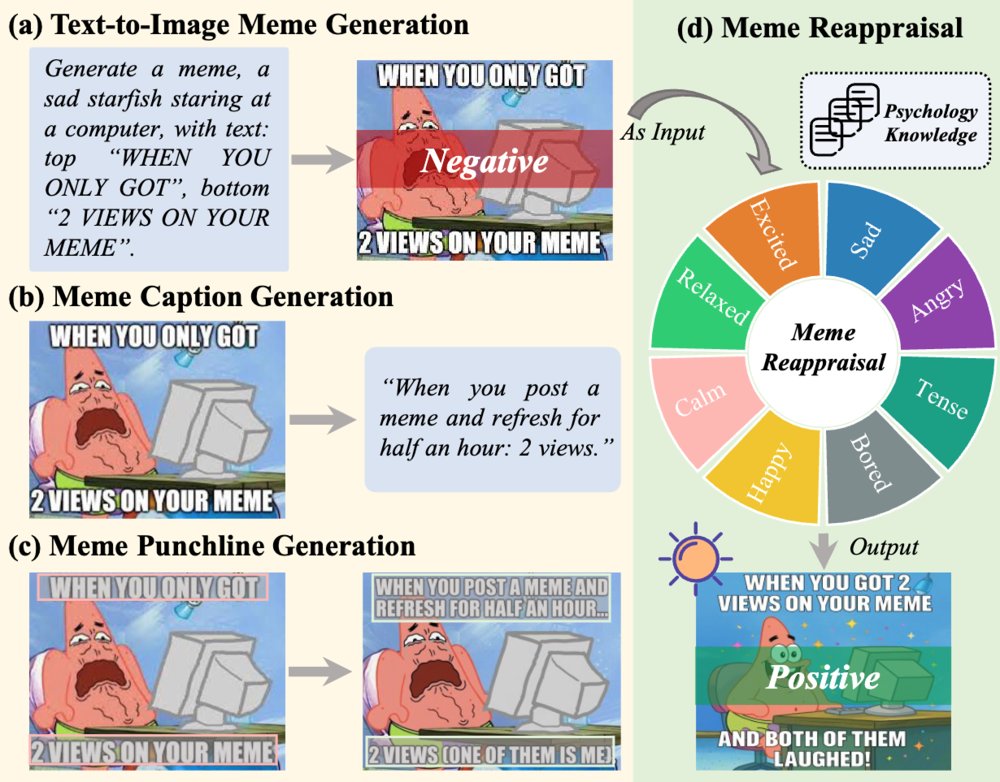

<!-- <p align="center">
  <a href="https://arxiv.org/abs/xxx">
    
  </a>
</p> -->

<h1 align="center">
  MER-Bench：A Comprehensive Benchmark for Multimodal Meme Reappraisal
</h1>

<!-- <p align="center">
  <a href="https://arxiv.org/abs/xxx">
    
  </a>
</p> -->

<p align="center">
  <strong>
    <a target="_blank" href="https://scholar.google.com/citations?user=iqZO3L4AAAAJ&hl=en&authuser=1">Yiqi Nie</a><sup>1,2</sup> ·
    <a target="_blank" href="https://scholar.google.com/citations?user=sdqv6pQAAAAJ&hl=en&authuser=1">Fei Wang</a><sup>2,3</sup> ·
    <a target="_blank" href="https://scholar.google.com/citations?user=q3NWGzUAAAAJ&hl=en&authuser=1">Junjie Chen</a><sup>2,3</sup> ·
    <a target="_blank" href="https://scholar.google.com/citations?user=UQ_bInoAAAAJ&hl=en&authuser=1">Kun Li</a><sup>4</sup> ·
    <a target="_blank" href="">Yudi Cai</a><sup>5</sup>
  </strong>
  <br/>
  <strong>
    <a target="_blank" href="https://scholar.google.com/citations?user=DsEONuMAAAAJ&hl=zh-CN">Dan Guo</a><sup>2,3</sup> ·
    <a target="_blank" href="https://scholar.google.com/citations?user=6kM00LQAAAAJ&hl=en">Chenglong Li</a><sup>1</sup> ·
    <a target="_blank" href="https://scholar.google.com/citations?user=rHagaaIAAAAJ&hl=en&authuser=1">Meng Wang</a><sup>2,3</sup>
  </strong>
  <p align="center">
  <sup>1</sup> Anhui University &nbsp;&nbsp;·&nbsp;&nbsp;
  <sup>2</sup> Hefei University of Technology &nbsp;&nbsp;·&nbsp;&nbsp;
  <sup>3</sup> IAI, Hefei Comprehensive National Science Center <br/>
  <sup>4</sup> United Arab Emirates University &nbsp;&nbsp;·&nbsp;&nbsp;
  <sup>5</sup> University of Science and Technology of China
  </p>
</p>

<p align="center">
MER-Bench is a comprehensive benchmark for multimodal meme reappraisal: transform negative memes into positive/calm/energizing ones while preserving scenario and meme style. It offers theory-informed emotion targets, paired image-text data, and multi-axis evaluation for emotion control, content preservation, and quality.
<br/>

</p>

<br/>

## Preparing the Data

Please use the Hugging Face CLI to download our dataset and the pre-generated model outputs from `LeoReverse/17nie`:

```bash
hf download LeoReverse/17nie --local-dir raw_data/
```

After downloading, organize the files into the `data/` directory with the following structure before proceeding to the evaluation step:

```text
data/
├── EditedResults/
│   ├── BAGEL-7B-MoT/
│   │   ├── 0001.png
│   │   ├── 0002.png
│   │   ├── 0003.png
│   │   └── ...
│   ├── DreamOmni2/
│   │   ├── 0001.png
│   │   ├── 0002.png
│   │   ├── 0003.png
│   │   └── ...
│   ├── FLUX.2-klein-4B/
│   │   ├── 0001.png
│   │   ├── 0002.png
│   │   ├── 0003.png
│   │   └── ...
│   ├── ...
│   └── Z-Image-Turbo/
│       ├── 0001.png
│       ├── 0002.png
│       ├── 0003.png
│       └── ...
├── Original/
│   ├── 0001.png
│   ├── 0002.png
│   ├── 0003.png
│   └── ...
└── index_final.json
```

## Evaluation

### Model Performance Across Evaluation Metrics

To reproduce the results reported in **Table 2** of the paper, first run the evaluation script:

```bash
python main.py --runs 10 --sample-size 100 --use-cache --rationale-first --images-first --mode-model-view
```

After the evaluation completes, compute the aggregated metrics by specifying the generated JSON file:

```bash
python results/table_2.py --input /path/to/generated-json-file --output table_2.csv
```

### Subcategory-Level Performance Across Evaluation Metrics

To reproduce the results in **Table 3**, run the evaluation script separately for each subcategory and collect the resulting JSON files.

```bash
# Visual Modality Category
python main.py --runs 10 --sample-size 50 --use-cache --rationale-first --images-first --mode-factor-view --visual-type Cartoon_Anime
python main.py --runs 10 --sample-size 50 --use-cache --rationale-first --images-first --mode-factor-view --visual-type Object_Animal_Dominant
python main.py --runs 10 --sample-size 50 --use-cache --rationale-first --images-first --mode-factor-view --visual-type Template_StylizedMeme
python main.py --runs 10 --sample-size 50 --use-cache --rationale-first --images-first --mode-factor-view --visual-type Photo_RealPerson

# Sentiment Polarity
python main.py --runs 10 --sample-size 50 --use-cache --rationale-first --images-first --mode-factor-view --sentiment-polarity Negative
python main.py --runs 10 --sample-size 50 --use-cache --rationale-first --images-first --mode-factor-view --sentiment-polarity Neutral
python main.py --runs 10 --sample-size 50 --use-cache --rationale-first --images-first --mode-factor-view --sentiment-polarity Positive

# Layout Type
python main.py --runs 10 --sample-size 50 --use-cache --rationale-first --images-first --mode-factor-view --layout-type SinglePanel_Meme
python main.py --runs 10 --sample-size 50 --use-cache --rationale-first --images-first --mode-factor-view --layout-type MultiPanel_Meme
```

Organize the generated JSON files into the directory `table_3_results` with the following structure:

```text
table_3_results
├── Cartoon_Anime.json
├── MultiPanel_Meme.json
├── Negative.json
├── Neutral.json
├── Object_Animal_Dominant.json
├── Photo_RealPerson.json
├── Positive.json
├── SinglePanel_Meme.json
└── Template_StylizedMeme.json
```

Then compute the aggregated metrics:

```bash
python results/table_3.py --input-dir /path/to/table_3_results --output table_3.csv
```

### Subcategory-Level Performance Across Models

To reproduce **Figure 5 (a–n)** in the paper, run the evaluation for each subcategory under the `model-view` mode and collect the resulting JSON files.

```bash
# Visual Modality Category
python main.py --runs 10 --sample-size 50 --use-cache --rationale-first --images-first --mode-model-view --visual-type Cartoon_Anime
python main.py --runs 10 --sample-size 50 --use-cache --rationale-first --images-first --mode-model-view --visual-type Object_Animal_Dominant
python main.py --runs 10 --sample-size 50 --use-cache --rationale-first --images-first --mode-model-view --visual-type Template_StylizedMeme
python main.py --runs 10 --sample-size 50 --use-cache --rationale-first --images-first --mode-model-view --visual-type Photo_RealPerson

# Sentiment Polarity
python main.py --runs 10 --sample-size 50 --use-cache --rationale-first --images-first --mode-model-view --sentiment-polarity Negative
python main.py --runs 10 --sample-size 50 --use-cache --rationale-first --images-first --mode-model-view --sentiment-polarity Neutral
python main.py --runs 10 --sample-size 50 --use-cache --rationale-first --images-first --mode-model-view --sentiment-polarity Positive

# Layout Type
python main.py --runs 10 --sample-size 50 --use-cache --rationale-first --images-first --mode-model-view --layout-type SinglePanel_Meme
python main.py --runs 10 --sample-size 50 --use-cache --rationale-first --images-first --mode-model-view --layout-type MultiPanel_Meme
```

Place the resulting JSON files into the directory `figure_5_a-n_results`:

```text
figure_5_a-n_results
├── Cartoon_Anime.json
├── MultiPanel_Meme.json
├── Negative.json
├── Neutral.json
├── Object_Animal_Dominant.json
├── Photo_RealPerson.json
├── Positive.json
├── SinglePanel_Meme.json
└── Template_StylizedMeme.json
```

Finally, compute the aggregated statistics:

```bash
python results/figure_5_a-n.py --input-dir /path/to/figure_5_a-n_results --output figure_5_a-n.csv
```

### Overall Benchmark Analysis

To reproduce **Figure 5(o)** in the paper, run the evaluation across the full benchmark:

```bash
python main.py --runs 10 --sample-size 700 --use-cache --rationale-first --images-first --mode-factor-view
```

Then compute the final aggregated metrics using the generated JSON file:

```bash
python results/figure_5_o.py --input /path/to/generated-json-file --output figure_5_o.csv
```